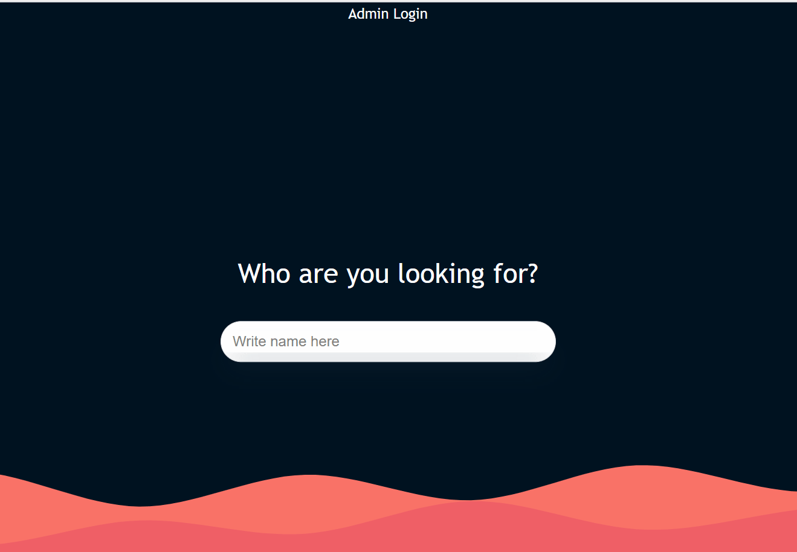

## Features

React project ported to Next.js and further developed.
CRUD functionalities for profiles of people.
API endpoints.
SQL datastorage.
Using Leaflet you can draw animated routes to where people are sitting.
Recoil for state management. To avoid crazy propdrilling.

## Installation / Getting Started

### First:

Clone the project.

### Second:

Install and run your docker on Docker-Desktop.

### Third:

Use the .env.dist as a template to set up your own private .env - fill out the format according to what you've used on Docker-Desktop for a good connection.

### Finally:

run these 3 commands in terminal:

```bash
npm install
# Installs dependencies...
docker compose up -d
# Composes the prewritten docker server and starts it up
npm run createDB
# Creates the database.
```

## To start the site write in terminal:

```bash
npm run dev
# starts the site
ctrl + c
# Can help you stop the process again.
```

Default Opens/Open [http://localhost:3000](http://localhost:3000) with your browser to see the result.

## Info

This project is called Seatplanner. It was my first 'big' solo project that i was tasked with at my internship as a developer. Along the way i learned a lot and many functionalities were brute forced trial and error.
Eventually it all worked out pretty well i think.
